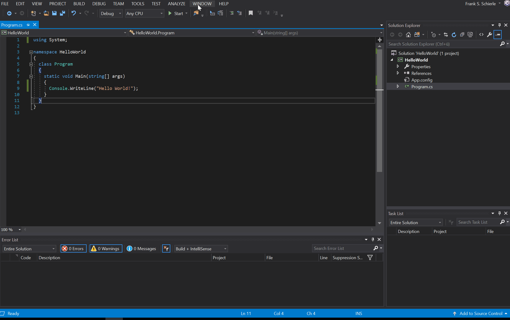
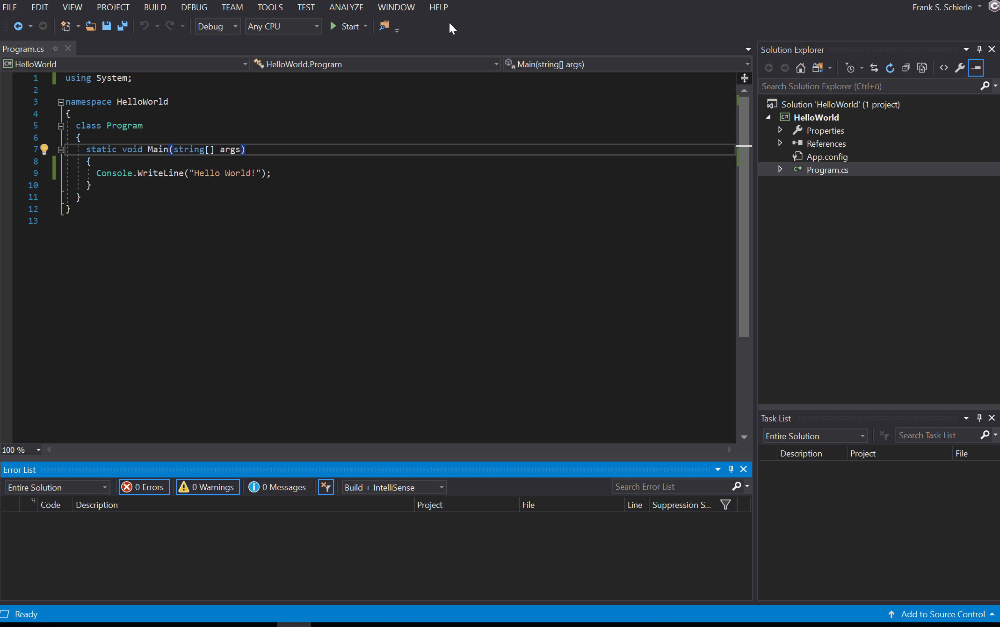
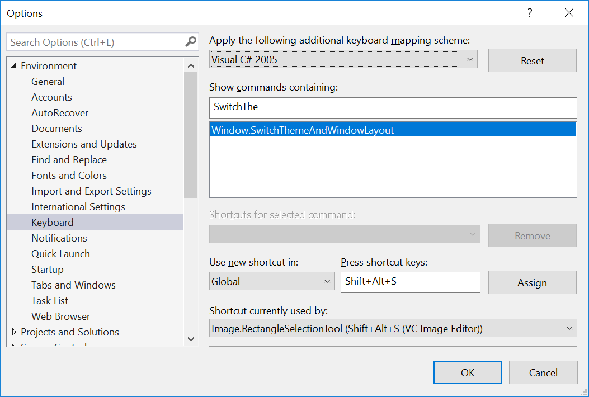

# Theme Switcher

Theme Switcher is a free Visual Studio extension that allows users to fast switch between two themes and window layouts.

This extension is for developers who often have to switch between a multi monitor window layout at their normal workplace and a single monitor window layout when using a projector. They could use Visual Studios built in functionality to switch between different window layouts. But imagine, the developer uses a theme that is hard to recognize when working with a projector. In this case the developer has to change the theme every time he moves from one place to the other using Visual Studios option dialog.

This extension enables the developer to switch between two themes and window layouts with just a single click or keyboard shortcut.

## Configuration

After installing the extension, a new page called "Theme Switcher" is available in Visual Studios option dialog.

Here you can define two themes and window layouts to switch between.

> Note: To define a window layout use Visual Studios built in functionality (WINDOW > Save Window Layout).

## Usage

After the configuration is done, the "Switch theme and window layout" command can be invoked using Visual Studios WINDOW menu.

## Advanced configuration

### Switching between themes and window layouts using a toolbar button

To switch between themes and window layouts using a toolbar button just add the Theme Switcher toolbar to the Visual Studio shell by right clicking on the free space inside the toolbar and enable the Theme Switcher toolbar.

### Switching between themes and window layouts using a keyboard shortcut

To switch between themes and window layouts using a keyboard shortcut just assign the desired shortcut to the command `Window.SwitchThemeAndWindowLayout`.

## Changelog
### Version 1.4
* Bugfix/Compatibility update: Fixed a NullReferenceException that occured in Visual Studio 16.8.

### Version 1.3
* Bugfix: NullReferenceException when no window layouts have been configured.

### Version 1.2
* Support for Visual Studio 2019 (Preview 1)
* The extension is initialized asynchronously. This will be a requirement in future versions of Visual Studio to work correctly.

### Version 1.1
* Fixed an issue that causes Visual Studio to freeze while applying the theme.

### Version 1.0
* Initial release.
